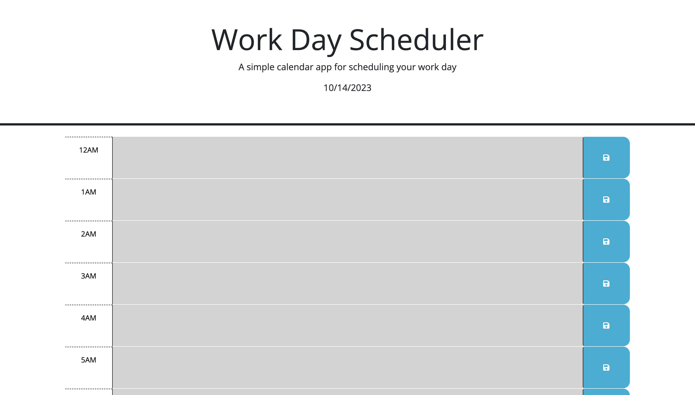
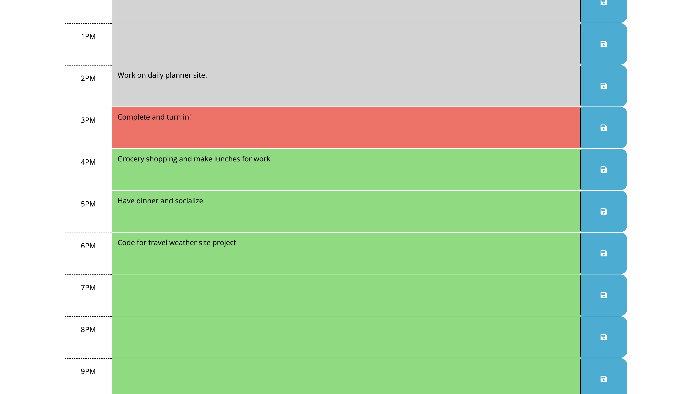

# Daily-Planner

## Live Site Link

https://cwhitecoding.github.io/Daily-Planner/

## Description

This site was created using HTML, CSS, and JavaScript. The purpose of this site is to be able to keep track of a busy day's schedule. This provides an easy and focused view of each hour's tasks, will provide today's date at the top of the page, will visually show the past, current, and future hours, and posesses the ability to save each input item. During the creation and bug fixing of this project, I learned to use DOM traversal, used jQuery, click events, utilized local storage, and expanded my knowledge on using functions. 

## Installation 

N/A

## Usage

To use this site, enter your schedule into the correct row's text area and hit the 'save' icon on the right side of the corresponding row. The web page will give you today's date at the top of the page as shown here:

Thenn select the correct hour necessary to schedule your event, click the save button on the right side of the corresponding row, and come back to the page to reference one's daily schedule as necessary. The text will be saved for whenever a user may need to reference their schedule. The colors will also visually aid the user in knowing what hour it is currently, and makes it easy to see what is coming up in their planned schedule. Here is an example of utilizing the process: 

## Credits

### Study session with a peer from another class: 1 hr.

## Tests

- Date at top of page displays correctly -> Check: good.
- Colors corretly display at current time -> Check: good.
- Input into text areas is allowed -> Check: good. 
- Save button allows to save and appears on refresh/reload -> Check: good.
